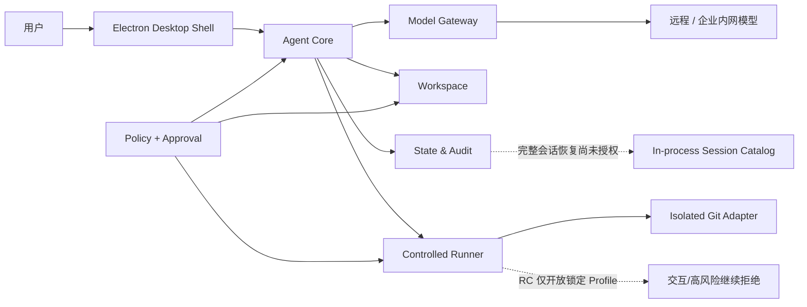

# win7-coding-agent

[](LICENSE)

面向 **Windows 7 SP1 x64** 的企业内部通用 Coding Agent 执行端与桌面客户端。
模型推理默认位于远程或企业内网服务；Win7 客户端负责可信交互、工作区读取与受控修改、
命令能力路由、验证、状态记录和审计。

> 当前结论：项目已完成 `MVP-20260802-14` 的 Win7 产品入口实机收口，状态为
> `OWNER_ACCEPTED_FOR_MVP`；A4/A5/A6 已完成主线收口，A7 发布候选又已取得
> 开发机、Win10 和 Win7 三层 PASS，唯一签名租约下 RC-01～RC-10 全部通过。
> A8 Review-first 产品已达到开发机 Validation Ready，但外部三层未完成。2026-08-22 又建立 A9
> Trusted Agent Runtime：需求、ADR 与任务书已确认，目标 `0.3.0-alpha.1`，当前仅为
> `APPROVED_FOR_IMPLEMENTATION / NOT_PERFORMED`，不继承 A7/A8 PASS。

[当前状态](docs/STATUS.md) · [架构](docs/ARCHITECTURE.md) ·
[路线图](docs/ROADMAP.md) · [任务书索引](docs/tasks/README.md) ·
[Win7 验证证据](validation/README.md)

## 为什么做这个项目

Windows 7 仍存在于部分工业、内网和受控企业环境，但现代 Coding Agent 通常默认依赖新的
操作系统 API、浏览器沙箱、终端、运行时和在线安装链。本项目将这些隐含前提拆成可验证的
Runtime Profile、能力探测和 fail-closed 边界，在不虚构现代系统安全能力的前提下，提供一条
可审计、可降级的 Win7 Agent 路径。

Windows 7 是唯一固定客户端平台，但项目不再全局限定 Python-only、stdlib-only 或 CLI-only。
经评审并锁定版本的 Python、Node.js、Electron、.NET Framework、Win32 原生组件和第三方依赖
均可进入组件 Profile；Phase 1/2 仍保持 CPython 3.8.10 + 标准库的冻结合同。

## 当前进展

| 范围 | 当前状态 | 已有证据或边界 |
|---|---|---|
| 文档与治理 | `READY_FOR_REVIEW` | 任务授权、ADR、当前状态、报告快照和文档一致性检查已建立 |
| Phase 1 Capability Probe | MVP 准备性实测完成；正式 Gate 未开放 | Win7 标准树 18/18 × 3；中文+空格路径 17 PASS + 1 个预期降级 |
| Phase 2 只读 Agent | 开发机合同已验证；Win7 正式验收待执行 | 保持 Python 3.8.10、只读、Mock/Replay、零网络合同 |
| Phase 3–7 TypeScript 基线 | 主线整合 | Gateway、Workspace、State、Core/Runner、Git Adapter、Shell 的模块化候选实现已纳入 `main` |
| 开发机整仓回归 | `PASS` | A7 收口基线：7 个模块、983 项测试；lint/build/静态设计门通过 |
| Win7 Electron 产品入口 | `OWNER_ACCEPTED_FOR_MVP` | Electron 22.3.27 启动、沙箱 Renderer、只读诊断、正常退出和进程清理已有实证 |
| Desktop Alpha 2 | `MVP PASS` | Win7 A2-W01～W15 证据齐备；拒绝不写入、批准后原子写入、撤销与恢复闭环已实测，正式 Phase Gate 不随 MVP 自动关闭 |
| SPIKE_03 Git Adapter | MVP 14/14 | 受控 MinGit 派生包通过 G10 矩阵；正式 SBOM、许可证和网络审计闭包待补 |
| SPIKE_02 | 受限收口 | D-013 v24 低风险非交互 Runner 与 H3 只读日志正式 Win7 PASS；交互 winpty No-Go，任意 Shell/高风险/未知 Profile 继续拒绝 |
| SPIKE_04 | `WIN7_PASS` | D-014 在本地 NTFS SSD Profile 完成 S01～S08、F01～F06、P08 与性能 #5～#8；A7 已完成产品装配 |
| A7 发布候选 | `RC_PASS` | 唯一 RC ZIP `39eecb6a…040c9` 已通过 RC-01～RC-10；交互 winpty、任意 Shell、高风险 Profile 仍不包含 |
| A8 Agent-first | `A8_DEVELOPER_COMPLETE_VALIDATION_READY` | 对话/会话/Review/SQLite/确定性包开发机 Gate 已闭合；最新候选 Win10/Win7 未执行 |
| A9 Trusted Agent Runtime | `APPROVED_FOR_IMPLEMENTATION` | 已确认 Full Access、PowerShell/CMD、直接文件工具、真实 Git、开放 Provider 与五条 Win7 Coding 旅程；功能尚未实现 |

最新的可变状态只在 [`docs/STATUS.md`](docs/STATUS.md) 和
[`docs/status/latest-validation.json`](docs/status/latest-validation.json) 维护；历史报告不覆盖当前结论。

## 已实现的工程能力

- **Agent Core**：Thread/Turn/Step 运行时、四维预算、取消、模型有界重试、卡死检测、
  Verification Gate、审批挂起/恢复、上下文压缩和版本化工具目录。
- **Model Gateway**：版本化流协议、HTTPS/TLS fail-closed、SSE 增量解析、有限重试、
  请求隔离、取消和结构化错误；桌面 MVP 默认仍为未配置或 Replay。
- **Workspace**：边界校验、只读 list/search/read、编码与换行识别、哈希绑定计划、
  有界 Diff、一次性审批、原子替换、回滚、恢复清单和撤销新计划。
- **State/Audit**：版本化事件协议、确定性投影、幂等与冲突检测、多订阅背压，
  以及已在 A7 RC 装配验收的 D-014 SQLite/WAL/FTS5 本地 SSD EventLedger。
- **Runner 与 Git Adapter**：结构化 argv、双超时、双流字节上限、关闭 stdin、能力拒绝语义，
  以及 Git 配置隔离、命令白名单和 Session Guard；D-013 v24 低风险非交互执行已获 Win7 PASS，
  交互终端、任意 Shell、高风险和未知 Profile 继续 fail-closed。
- **Desktop Shell**：Electron 安全策略、Schema 校验 IPC、只读诊断、Replay 纵向切片，
  以及 Desktop Alpha 2 的受控单文件修改 UI。

### 当前实现与 A9 已授权方向

| 能力 | MVP 行为 | 放行条件 |
|---|---|---|
| 低风险非交互命令 | 当前仅开放锁定 D-013 Profile | A9-02 实现 TrustedShellRunner 并重新执行 Win7 进程矩阵 |
| 交互终端 | 明确拒绝，winpty No-Go | 不进入 A9 Alpha 1；模型 Shell 仍关闭 stdin |
| 任意 Shell | 当前代码拒绝 PowerShell/CMD | A9 已授权 PowerShell 5.1 优先、CMD 降级的通用 Shell；尚未实现 |
| 跨重启持久状态 | A8 已完成 SQLite Session/Goal/Review 开发机 Gate | A9-06 增加模式、checkpoint、Shell/Git 恢复事实并重新验收 |
| 真实模型与企业网络 | A8 有受控 Gateway/DeepSeek，正式 UI 默认 Replay | A9-04 泛化任意 OpenAI-compatible Provider，正式 UI 默认真实模型 |
| 多文件/任意编码写入 | 当前只有 A8 staging 与 A2 单文件路径 | A9-03 直接文件工具、每轮 checkpoint、UTF-16/CP936 与 Shell 外部变化 |
| 安装、升级和回滚发布闭包 | A7 RC 闭包已通过，尚未获得正式发布批准 | 进入生产发布前需完成版本标签、渠道、支持周期和发布治理 |

## 架构概览



Renderer 不直接获得文件、进程、凭据或任意网络权限。高权限操作必须经过版本化 Schema、
Policy、精确审批绑定和审计；Git 还需要隔离配置以阻止 hooks、filters、pager、凭据助手等
间接执行面。完整安全边界见 [`AGENTS.md`](AGENTS.md) C01–C20 和
[`docs/WIN7_CONSTRAINTS.md`](docs/WIN7_CONSTRAINTS.md)。

## 开发与验证

### 开发机前置

- Node.js `>=16.17.1` 与 npm，用于 Phase 3–7 模块开发和验证；
- CPython 3.8.10 x64，仅用于 Phase 1/2 冻结组件的兼容验证；
- Win7 目标机不假设预装上述工具，正式交付必须使用已登记、锁定并验收的自包含工件。

当前根目录只编排模块命令，不在线解析生产依赖。首次在开发机检出仓库后，分别进入以下目录
执行 `npm ci`：

```text
src/core
src/gateway
src/git-adapter
src/runner
src/shell
src/state
src/workspace
```

随后从仓库根目录运行：

```bash
npm run verify:quick  # 7 个模块的类型检查与构建
npm run verify        # lint、构建、测试和不可绕过的静态设计门
npm run docs:check    # 本地链接、任务元数据和状态一致性
```

也可以在单个模块内执行：

```bash
npm run lint
npm run build
npm test
```

现代开发机通过只证明源码与逻辑合同可回归，不能代替 Win7、原生依赖、企业网络或正式发布验收。

### Phase 1 Capability Probe

Phase 1 保持 CPython 3.8.10 标准库合同。在 Windows `cmd.exe` 中从仓库根目录运行：

```bat
scripts\run_probe.bat
scripts\run_probe.bat --out "D:\中文 目录\probe_report.json"
scripts\run_probe.bat --list
scripts\run_tests.bat
```

Probe 只做离线环境检测，不安装软件、不修改系统配置、不访问网络。JSON 是权威输出；退出码
`0` 表示全部通过，`1` 表示存在可降级能力，`2` 表示失败或检查错误，`3` 表示参数或报告写出错误。
Win7 正式步骤见 [`tests/win7/README.md`](tests/win7/README.md)。

## Win7 MVP 证据

- [当前状态与延期项](docs/STATUS.md)
- [Win7 MVP 实机验收报告](docs/reports/2026-08/win7_mvp_acceptance_report.html)
- [负责人 MVP disposition](docs/acceptance/MVP-20260802-14_OWNER_DISPOSITION.json)
- [最新结构化验证状态](docs/status/latest-validation.json)
- [真实 Electron 产品入口 smoke](validation/report_product_shell_MVP-20260802-14.json)
- [剩余 C01–C20 验收方案](docs/reports/2026-08/win7_remaining_constraints_acceptance_plan.html)
- [各 Spike / Phase 证据索引](validation/README.md)

仓库中的证据用于审计和复跑，不等于正式产品发布包。Electron 便携目录、运行时缓存和私有验收
连接材料不会提交到源码仓库；正式工件必须通过哈希、许可证、SBOM 和交付闭包后单独发布。

## 仓库结构

```text
AGENTS.md                         项目最高约束与实现授权规则
docs/
  STATUS.md                      当前状态的唯一人类可读入口
  ARCHITECTURE.md                当前实现、目标架构与边界
  WIN7_CONSTRAINTS.md            Win7 Profile、依赖登记和兼容红线
  DECISIONS.md                   ADR 决策记录
  tasks/                         Phase、Spike、整合与验收任务书
  reports/                       按日期冻结的审计和验收报告
  status/                        机器可读状态与 MVP 基线
scripts/
  verify_integration.mjs         根级整合验证编排
  check_docs.mjs                 文档一致性检查
  mvp_acceptance/                MVP 构建与证据采集脚本
spikes/                          Win7 Runtime、Terminal、Git、Storage 实机 Spike
src/
  phase1-2/                      Python 3.8.10 冻结阶段代码
  gateway/                       模型协议与安全网络边界
  workspace/                     只读工具与受控写入
  state/                         事件、投影、审计与状态
  core/                          Agent Runtime、上下文、策略与验证
  runner/                        命令执行合同和审批绑定
  git-adapter/                   Git 隔离与 Session Guard
  shell/                         IPC、Updater 与 Electron 产品入口
tests/                           Phase 1/2 与 Win7 验收入口
validation/                      实机证据和交叉论证
```

## 路线图

1. 冻结已验收 RC 字节、manifest、SBOM/许可证和 Win7 证据，完成主线、标签与长期归档治理。
2. 以独立任务书决定 RC 是否晋升为正式发布；不重建或静默替换已验收 ZIP。
3. 在企业代理、CA、模型和更新服务就绪后执行 E7，补齐正式候选的视觉、重启、物理断网和
   严格干净环境证据。

详细顺序、Gate 和完成标准见 [`docs/ROADMAP.md`](docs/ROADMAP.md) 与
[`docs/tasks/README.md`](docs/tasks/README.md)。

## 给贡献者和 Coding Agent

开始修改前必须依次阅读：

1. [`AGENTS.md`](AGENTS.md)；
2. [`docs/WIN7_CONSTRAINTS.md`](docs/WIN7_CONSTRAINTS.md)；
3. 当前分支对应的 [`docs/tasks/`](docs/tasks/README.md) 任务书。

实现代码默认禁止，只有任务书状态为 `APPROVED_FOR_IMPLEMENTATION` 且目标文件位于允许路径时
才能修改（C14 / ADR-0011）。新增运行时、依赖、原生模块或外部程序必须先登记；影响接口、
数据格式、兼容性或安全模型的决定必须追加 ADR。Win7 实机验收前不得把开发机结果表述为阶段完成。

## 许可证

Copyright 2026 allin2.

本项目原创代码与文档采用 [Apache License 2.0](LICENSE) 开源。第三方依赖、运行时、验收工件
和引用材料继续遵循各自的许可证与归属声明；根许可证不会覆盖或改写第三方许可条件。
