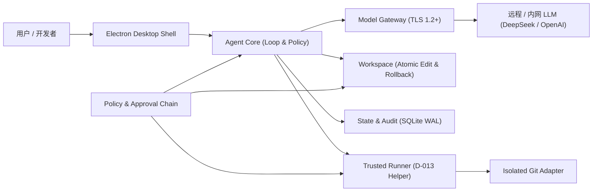

# Win7 Coding Agent

[](LICENSE)
[](docs/WIN7_CONSTRAINTS.md)
[](package.json)

面向 **Windows 7 SP1 x64** 的企业内部通用 Coding Agent 执行端与桌面客户端。

模型推理默认位于远程或企业内网服务（如 DeepSeek 等 OpenAI 兼容接口）；Win7 端负责受控交互、工作区安全读写、命令隔离执行、状态事务与完整合规审计。

---

## 核心特性

- 🛡️ **Win7 深度适配与强边界**：原生适配 Windows 7 SP1 x64 环境，基于 Win32 Job Object 与 D-013 隔离帮助程序 (`helper.exe`)，实现进程树受控清理与防僵尸进程保障。
- ⚡ **无依赖绿色便携包**：发布包自包含 Electron 22.3.27（Win7 最终支持分支）、预编译 SQLite 3.43 原生模块及精简便携 Git，目标机无需安装 Node.js、Python 或构建工具链。
- 🔄 **原子工作区读写与快照回滚**：全量文件写入具备编码探测（UTF-8、GBK、UTF-16LE）、确定性 Diff、每轮检查点与一键回滚能力。
- 📜 **SQLite WAL 事件账本**：会话、计划、交互审计均写入本地高性能 SQLite WAL 数据库，支持离线追溯与故障恢复。
- 🔒 **严格的安全模型与 IPC 隔离**：渲染进程与系统内核严格隔离，所有高权限操作均经 Schema 强校验 IPC、安全策略链与目标绑定确认。

---

## 架构概览



---

## 快速开始

### 1. Windows 7 用户运行（免安装）

#### 系统前置要求
1. **操作系统**：Windows 7 SP1 x64 (Build 7601)
2. **必需补丁**（确保系统支持 SHA-2 签名与 TLS 1.2，补丁包见 `.acceptance/deps/kb/`）：
   - `KB4474419` & `KB4490628`（SHA-2 代码签名支持与服务堆栈更新）
   - `KB3140245`（TLS 1.2 传输层安全协议）
3. **硬件**：建议本地 NTFS SSD 分区（保障 SQLite WAL 并发事务性能）

#### 启动步骤
1. 前往 **[GitHub Releases 页面](https://github.com/allin2/win7-coding-Agent/releases/tag/v0.3.0-alpha.1)** 下载便携版压缩包 `Win7CodingAgent-0.3.0-alpha.1-win7-x64.zip`。
2. 解压至本地无特殊字符路径（如 `D:\Tools\Win7CodingAgent`）。
3. 双击运行主程序 `electron.exe`。
4. 首次启动在设置中配置远程/内网 LLM 端点（Base URL、API Key、模型名称）。

---

### 2. 开发者构建指南

本项目采用 **"开发机构建 → Win7 端运行"** 的交叉分发模式。

#### 开发机环境
- **Node.js** `>=16.17.1`
- **npm** `>=8.15.0`

#### 安装与验证
```bash
# 1. 克隆代码仓库
git clone https://github.com/allin2/win7-coding-Agent.git
cd win7-coding-Agent

# 2. 安装所有工作区依赖
npm ci

# 3. 快速语法与构建验证
npm run build

# 4. 执行完整回归测试（7 个模块、1,581+ 单元/契约测试）
npm test

# 5. 检查文档与规范一致性
npm run docs:check
```

#### 生成 Win7 发布包
```bash
# 构建确定性 Win7 便携交付包
npm run package:win7
```

---

## 仓库模块结构

本项目采用 npm Workspaces 多模块单体仓（Monorepo）结构：

```text
├── src/
│   ├── core/           # Agent 核心运行状态机、多轮循环与策略网关
│   ├── gateway/        # 远程模型流式通信客户端（OpenAI / DeepSeek 协议兼容）
│   ├── runner/         # 进程执行器与 D-013 隔离进程管控
│   ├── shell/          # Electron 桌面外壳、安全 IPC Schema 与 UI 入口
│   ├── workspace/      # 工作区安全读写、编码侦测、检查点与回滚引擎
│   ├── state/          # SQLite WAL 事务持久化、审计流水与事件账本
│   └── git-adapter/    # 隔离受控 Git 适配器与 Session Guard
├── native/
│   └── helper/         # Win32 C++ 隔离帮助程序源码与构建套件 (D-013)
├── release/            # 发布闭包规范、输入锁定 (Input-lock) 与 Win7 验证脚本
├── scripts/            # 整合构建、文档审查与自动化工具
└── docs/               # 架构说明、Win7 平台约束与 ADR 决策记录
```

---

## 关键文档与治理指引

在对本仓库提交代码或进行架构调整前，请务必阅读对应规范：

| 规范主题 | 核心文档 | 说明 |
|---|---|---|
| **最高准则** | [AGENTS.md](AGENTS.md) | 仓库执行总入口、实现授权白名单与安全红线 |
| **当前状态** | [docs/STATUS.md](docs/STATUS.md) | 项目最新状态、功能放行判定与里程碑记录 |
| **Win7 平台约束** | [docs/WIN7_CONSTRAINTS.md](docs/WIN7_CONSTRAINTS.md) | C01–C20 平台红线、Runtime Profile 与依赖白名单 |
| **架构与安全** | [docs/ARCHITECTURE.md](docs/ARCHITECTURE.md) | 进程拓扑、内存预算与安全威胁模型 |
| **决策记录** | [docs/DECISIONS.md](docs/DECISIONS.md) | 历次架构决策（ADR-0001 ~ ADR-0118）不可变归档 |
| **任务书索引** | [docs/tasks/README.md](docs/tasks/README.md) | 各阶段 Phase、Spike、Alpha 任务书索引与边界 |
| **实机验证** | [validation/README.md](validation/README.md) | Windows 7 实机验收证据索引 |

---

## 开源许可证

本项目原创代码与文档采用 [Apache License 2.0](LICENSE) 开源。
第三方依赖、运行时与构建工件遵循其各自的原生许可协议。
