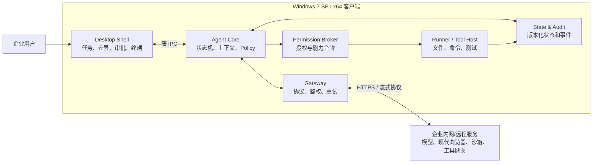
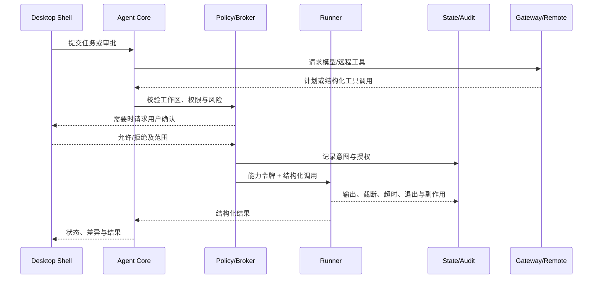

# ARCHITECTURE — 系统架构

本文档描述 ADR-0027 之后的**最终目标架构**，并明确区分当前冻结实现、候选技术与未来授权。唯一固定客户端条件为 Windows 7 SP1 x64；语言、运行时、依赖、界面形态和交付模式由组件 Profile 与任务书决定。

状态标签：

- `[历史冻结实现]`：已由现有 Phase 任务书定义，继续按原合同验证。
- `[当前已授权]`：可在现有任务书的分支与路径白名单内实现。
- `[候选待 Spike]`：仅是待验证设计，不构成实现授权。
- `[未来待授权]`：必须新增 `APPROVED_FOR_IMPLEMENTATION` 任务书。

## 1. 总体拓扑



Win7 端不再被定义为“Python 纯执行 CLI”。它可以包含桌面界面、后台协调进程和多个受限工具宿主；模型推理默认远程化。任何本地或远程组件都不能绕过 Policy、Permission Broker 和审计直接修改工作区或启动进程。

## 2. 四个核心边界

### 2.1 Desktop Shell

职责：

- 任务/会话列表、流式消息、计划与进度。
- 文件引用、差异预览、审批、回滚和审计查看。
- 用户直接操作的交互终端；与 Agent Runner 的非交互执行通道隔离。
- 连接状态、能力降级、更新状态和可诊断错误展示。

`Electron 22.3.x` 是 Win7 桌面壳的候选线，建议 Spike 锁定其末版 `22.3.27`；它是兼容性候选，不是当前实现授权，也不代表后续可不经评审升级。候选安全基线为：

- Renderer 只加载打包的受控本地资源，不承载任意外部网页。
- `nodeIntegration: false`、`contextIsolation: true`、沙箱开启，使用最小化 Preload API。
- IPC 使用显式 allowlist、结构化 Schema 和调用方身份校验。
- CSP 的 `connect-src`、Electron Session 请求过滤与权限处理器共同限制浏览器原生网络和
  设备权限；不能用“没有 Node 权限”推导 Renderer 不能联网。
- 拒绝任意导航、新窗口和协议调用；外部链接交由受控系统浏览器。

独立 Node.js 12 可作为 CLI/辅助进程候选，但不是 Electron 嵌入式 Node 的替代要求；精确补丁版本、原生模块 ABI 和 Win7 实机结果由 Spike 决定。ADR-0028（Proposed）作为 **Electron 首选实施 Profile**（"可交付 Win7"以 SPIKE_01 实机为准，未通过前不表述为"已满足 Win7"）进一步提议：v1 统一为 Electron 22.3.27 单栈，进程边界为 main（仅编排）/ Agent Core（独立 `utilityProcess`，关闭 `runAsNode` fuse、不用 `ELECTRON_RUN_AS_NODE`）/ Renderer（最小权限）；**唯一自研原生组件**为一个 C++ x64 helper（D-013），另有 winpty/node-pty、SQLite 绑定、MinGit 等原生工件按 WIN7_CONSTRAINTS §6 登记；降级各档须另配独立 Core 宿主，淘汰路线见该 ADR。

### 2.2 Agent Core

职责：

- 任务状态机、上下文裁剪、工具目录、计划与结果归并。
- Policy 先于执行，审批结果转成短期、窄范围能力令牌。
- 工作区会话、取消、恢复、幂等和事件顺序。
- 多任务/多 Agent 的逻辑调度与资源预算。

Core 是运行时无关的逻辑边界，可以由经批准的 Python、Node.js、.NET Framework 或原生组件承载。并发不是全局禁令，但对同一工作区的写操作必须串行化或加锁，且每个 Runner 有独立取消、输出和资源预算。

### 2.3 Runner / Tool Host

Runner 是进程与高风险本地能力的唯一入口：

- 接收结构化 `executable + argv + cwd + env allowlist`，禁止执行模型拼接的 Shell 字符串。
- 强制超时、标准输入策略、输出上限、进程树终止和结构化错误。
- 文件读写、补丁、Git、测试、终端和未来插件能力均通过可审计 Tool Adapter 暴露。
- Agent 命令默认非交互；用户终端使用独立会话、独立权限和独立审计类型。
- Git 使用专用 Adapter 和隔离的配置/环境；hooks、filters、textconv、pager、external
  diff、credential/SSH helper、fsmonitor 等间接执行入口必须覆盖、拒绝或移至远程。
- 用户终端的 stdin 能力只授予明确的用户输入事件，模型/Core/插件不能向其注入命令、
  按键或粘贴；终端输出的 VT/OSC、链接、剪贴板和外部协议按不可信输入限制。
- 写操作遵守“校验前置 → 备份/快照 → 原子替换 → 验证 → 可回滚”。

Windows 实现候选包括 Job Object、受限令牌、ACL 与 `taskkill /T /F` 降级。Win7 Job Object 的嵌套限制必须在宿主环境中验证，不能把现代 Windows 的嵌套作业行为作为前提。
若无法建立可靠 containment，高风险或可派生子进程的 Agent 命令必须拒绝或远程执行；
`taskkill`/PID 树只可作为获批低风险命令与历史组件的兼容回收，不等价于安全沙箱。

### 2.4 Gateway

职责：

- 连接模型、现代浏览器/沙箱和企业工具网关。
- 协议版本协商、鉴权、证书/代理、重试、退避、心跳与断线恢复。
- 流式事件归一化、大小限制、幂等键和取消传播。
- 把远程能力映射为与本地工具一致的 Policy/审计对象。

Gateway 不再限定为 Python 标准库 HTTP 客户端。任务书必须选择精确运行时、传输协议、CA/代理策略、凭据存储与离线行为，并在目标 Win7 补丁状态下验证。

## 3. 当前实现与冻结合同

| 组件 | 状态 | 说明 |
|---|---|---|
| 文档与 ADR 体系 | `[当前已授权]` | 可继续维护，但关键决策必须新增 ADR |
| `win7_agent.probe` | `[历史冻结实现]` | Phase 1 继续使用 CPython 3.8.10 标准库；完成状态仍取决于 Win7 E1/E2 验收 |
| 只读代码分析 Agent | `[当前已授权]` | 仅按 Phase 2 任务书、指定分支与允许路径实现；Mock/Replay、目标工作区只读、无真实模型/网络 |
| Desktop Shell | `[候选待 Spike]` | Electron 22.3.27 等候选必须先有独立兼容性 Spike 任务书 |
| 通用 Agent Core、Runner、Gateway | `[未来待授权]` | 本文只冻结边界，不授权代码 |
| 写入、交互终端、后台服务、插件、多 Agent | `[未来待授权]` | 不再全局禁止，分别经过任务书、安全模型和 Win7 验收后引入 |

ADR-0027 不修改 Phase 1/2 的 Python 3.8.10、标准库、零网络、只读、分支和路径白名单合同，也不允许把新运行时文件放入既有白名单。

## 4. 关键架构原则

1. **Profile 驱动**：每个可交付组件声明 OS 补丁、架构、精确运行时、依赖闭包、入口、工作目录、可写目录、网络和降级策略。
2. **能力探测优先**：启动和安装先读取 Probe/Preflight 结果；缺失能力时禁用功能并解释原因，不以不安全替代静默继续。
3. **界面与权限分离**：Desktop Renderer 不持有文件、进程、凭据或网络任意访问权；所有高权限动作走窄 IPC 和 Broker。
4. **执行不可旁路**：业务逻辑、插件和 UI 不得直接启动进程或写工作区；Runner 统一执行
   C08/C09，Git 和用户终端还分别满足 C20/C19。
5. **协议与状态版本化**：报告、IPC、远程协议、SQLite/事件和插件 Manifest 均带版本并支持拒绝不兼容输入。
6. **审计先于副作用**：先记录意图和授权，再执行；结果、截断、取消、超时和回滚均成为事件。
7. **最小本地攻击面**：旧 Chromium 不访问不可信 Web；Browser Use、现代沙箱和高风险第三方集成优先远程化。
8. **可恢复交付**：安装、升级和数据迁移有完整性校验、备份和回滚；网络可用不等于允许运行时任意下载。
9. **Win7 实机为最终证据**：现代系统上的单测、类型检查和构建只是代理证据。

## 5. Win7 能力降级与远程化

| 现代能力 | Win7 约束 | 目标设计 |
|---|---|---|
| ConPTY/现代伪终端 | Win7 不提供 | 用户终端使用经验证的 winpty 适配器；不可用时降级为非交互命令与日志视图 |
| VT/Unicode 控制台 | conhost、CP936 与字体能力不稳定 | GUI/协议/文件统一 Unicode；CLI Adapter 做编码探测、替换与纯文本降级 |
| Chromium Browser Use | Win7 可用 Chromium 版本陈旧 | 本地 Shell 仅渲染受控 UI；网页自动化在现代远程 Worker 执行 |
| WSL2/Docker Desktop/Windows Sandbox | 不能作为 Win7 本地能力 | 放到开发机或远程 Sandbox；本地通过 Gateway 调用 |
| 现代 AppContainer/WinUI 3/MSIX | 不可作为通用基线 | 使用进程隔离、受限令牌、ACL、自包含目录或企业安装器 |
| 长路径与链接语义 | `MAX_PATH`、junction/reparse point 行为复杂 | PathSafe 做规范化、根边界和 reparse 检查；包路径保持短且可配置 |
| Job Object 嵌套 | Win7 不支持嵌套 Job | Runner 探测宿主作业状态；无法可靠 containment 时拒绝/远程执行高风险命令，`taskkill` 仅为低风险兼容回收 |
| 系统 TLS/CA | 取决于补丁与企业镜像 | 安装前探测，Profile 声明补丁、TLS、代理和 CA；失败可诊断，不降级到跳过证书校验 |

## 6. 进程、IPC 与数据流

建议的最小进程边界为 Desktop Shell、Agent Core、Runner/Tool Host。Gateway 可以先内嵌于 Core，成熟后独立；后台协调器、插件宿主或多个 Runner 只在任务书证明必要时拆分。



阶段 1 Probe 独立于该主数据流，仍是一次性 CLI 并输出历史任务书定义的版本化 JSON。阶段 2 仍使用其私有、固定只读 Git 子进程实现；不得将它宣称为通用 Runner。

## 7. 状态、并发与扩展

- 本地持久化优先使用带 `schema_version` 的 SQLite/事件存储，但实际驱动和打包方式由运行时 Profile 决定。
- 多任务可并发进行只读分析或远程等待；同一工作区的写入按锁、队列或隔离工作树策略执行。
- 后台进程允许作为未来部署 Profile，但必须定义启动/停止、崩溃恢复、日志、单实例、升级和卸载；不得偷偷创建持久化。
- Skills、Hooks、MCP/插件不再是架构非目标。未来扩展必须具有版本化 Manifest、权限声明、来源/完整性、运行边界、超时和资源配额；不得把不可信扩展直接加载进 Desktop Renderer。

## 8. 逻辑目录规划

以下仅表示长期模块边界，不是路径白名单，也不构成创建文件的授权：

```text
win7-coding-agent/
  docs/                  # 约束、ADR、任务书、协议和验收
  legacy/                # Phase 1/2 历史冻结组件（实际路径以任务书为准）
  desktop/               # Desktop Shell（未来任务）
  core/                  # Agent Core、Policy、上下文与调度（未来任务）
  runner/                # Runner、终端和 Tool Adapters（未来任务）
  gateway/               # 远程协议与连接器（未来任务）
  protocols/             # IPC、远程事件、插件 Manifest Schema（未来任务）
  packaging/             # Profile、清单、安装、升级与回滚（未来任务）
  tests/                 # 单元、集成、契约、Win7 与端到端验收
```

任何实现目录或文件只有在状态为 `APPROVED_FOR_IMPLEMENTATION` 的任务书中被列入允许路径后才能创建（AGENTS.md C14）。

## 9. 不可突破的架构边界

- 不把 Win10+ API、ConPTY、WSL2、Docker Desktop 或现代 Chromium 安全能力伪装成本地可用。
- 不允许模型、Renderer、插件或远程服务绕过 Policy/Broker/Audit 直接执行。
- 不因“企业内网风险较低”取消结构化参数、工作区边界、超时、输出上限、进程终止和完整性验证。
- 不用架构文档、路线图或 ADR 候选项替代实现任务书与 Win7 实机验收。
